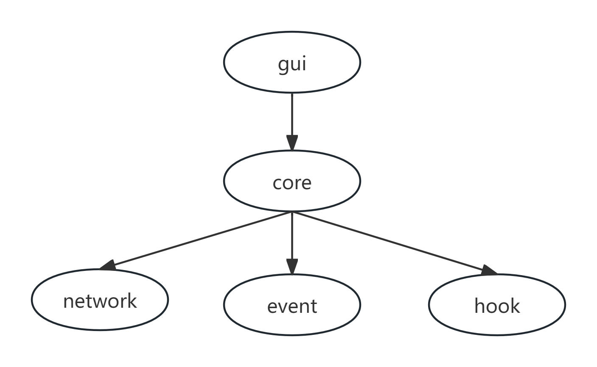

## kmshare：一个小工具用以支持键盘鼠标跨设备流转

### 一、创作背景

1. 笔者因拥有多台不同操作系统的电脑，因此需要配备多套键盘鼠标来操作不同的电脑。且在切换电脑的时候，经常习惯性地按离手近的键盘，切换起来相当麻烦。
2. 所以计划做一个小工具，以实现使用一套键盘鼠标来操作多台电脑的需求。
3. 设计目标如下：

   * 支持Windows Linux MacOS三端
   * 仅支持局域网，不计划支持公网
   * 尽可能还原原机使用体验

### 二、实现原理与架构设计

#### 2.1 目录结构

```plaintext
|-assets
|-core
|-|-event
|-|-hook
|-|-network
|-gui
|-|-resource
|-|-subwidget
|-|-kmsharewindow.cpp
|-|-kmsharewindow.h
|-.gitignore
|-CMakeLists.txt
|-LICENSE
|-README.md
|-startup.cpp
```

#### 2.2 架构设计



#### 2.3 实现原理

##### 概括

* 不同于真正意义上的键盘鼠标映射到另一台设备，只是共享键盘鼠标消息，在接收方进行消息模拟
* 设备和设备之间使用TCP连接，只支持同一局域网，不计划支持公网
* 共享键盘鼠标消息的设备：监听键盘鼠标消息并按指定规则封装成json字符串，通过TCP发送给接收方
* 接收键盘鼠标消息的设备：通过TCP接收json字符串，并解析，然后调用操作系统的API或其它方式对消息进行模拟
* 共享键盘鼠标消息的设备在共享时，拦截除鼠标移动之外的其它消息，不进行响应。

##### 消息抽象

* core/event目录下是对消息的自定义抽象
* 有一个abstractevent.h的纯虚基类，里面有一个post和toString的纯虚函数。由它派生鼠标消息和键盘消息的子类并各自实现
* post的方法即为消息的模拟方法，此函数里针对不同平台各自实现不同的模拟方式
* toString方法，将本消息封装为json字符串，并返回
* 鼠标消息类和键盘消息类，各自实现fromJsonString的方法，将json字符串转为本类对象
* 鼠标消息和键盘消息的子类其它成员按需添加

##### 消息监听

* core/hook目录下是对消息的监听
* Windows平台：使用Windows hook技术监听除鼠标移动之外的其它消息，鼠标移动消息不进行监听，使用定时器定时获取
* Linux平台：待确认
* MacOS平台：待确认
* 监听到消息之后将其封装为core/event中的类对象，并调用toString方法转为json字符串，发送给接收方

##### 消息模拟

* 消息的模拟方式就是core/event目录下，前面提到的类中的post方法
* Windows平台：鼠标消息使用mouse_event方法或者INPUT结构体方式。键盘消息使用keybd_event方法或者INPUT结构体方式
* Linux平台：待确认
* MacOS平台：待确认

##### 设备连接方式

* core/network目录下即为设备之间连接的模块
* 设备和设备之间使用TCP进行连接
* 共享方作为服务端，接收方作为客户端。允许一对多共享
* 已连接设备封装为一个Device的结构，包含设备的ip、主机名、是否共享给此设备等内容
* 已连接设备将会存在于一个设备列表之中，每次共享时，遍历列表给合适的设备发送消息

### 三、分支与开发模式说明

#### 3.1 分支说明

* master分支是开发主干分支，包含最新代码，且具有巨大的不稳定性或其它问题
* release_vx.x.x_branch分支为发布分支，一般会构建出包上传github，其中x.x.x为版本号

#### 3.2 开发模式

* 新功能在master分支开发，bug或其它问题在master分支解决
* master分支达到一定水准之后，基于master分支拉出release分支进行发版留档

#### 3.3 版本号说明

* x.x.x为版本号格式
* 第一个数字表示架构大重构的次数
* 第二个数字表示新增功能数
* 第三个数字表示已解决的bug数
* 每一次前面的数字加1，后面的数字归零

### 四、源码构建方式

#### 4.1 环境准备

* git：推荐直接使用最新版本，无特殊要求
* cmake：3.16以上，推荐使用最新版本
* Qt：使用5.15.15版本
* CXX编译器：需支持C++14标准
  * Windows平台：推荐使用MSVC
  * Linux平台：推荐使用gcc
  * MacOS平台：推荐使用xcode包里带的Apple Clang

#### 4.2 获取源码

##### 克隆主仓库（https://github.com/junuo-S/kmshare）

`git clone https://github.com/junuo-S/kmshare.git`

##### 克隆cmake子仓库（https://github.com/junuo-S/cmake）

* 进入上面克隆下来的kmshare目录克隆子仓库

`cd kmshare`

` git clone https://github.com/junuo-S/cmake.git`

* 打开cmake/config.cmake文件，将Qt目录更改为自身的Qt目录即可开始构建

#### 4.3 开始构建

* 建议新建一个debug目录去构建

```plaintext
cd kmshare
mkdir debug
cd debug
cmake ../ -G"XXX"  # 根据自身情况选择合适的生成器
cmake --build . 或 make -j16  # Makefile构建的使用后者，其它编译情况根据自身使用的生成器决定
```

* 编译产物在debug/output目录下

### 五、待办列表

* [ ] Windows平台鼠标消息监听与模拟
* [ ] MacOS平台鼠标消息监听与模拟
* [ ] Linux平台鼠标消息监听与模拟
* [ ] Windows平台键盘消息监听与模拟
* [ ] MacOS平台键盘消息监听与模拟
* [ ] Linux平台键盘消息监听与模拟
* [ ] 寻求更为合适的开始与停止共享快捷键方案
* [ ] 设备列表视图开发
* [ ] 消息录制与回放
* [ ] 互发文字内容
* [ ] 文件互传
* [ ] ......

### 六、写在最后

* 这个工具说起来原理很简单，但是做起来真的工作量以及细节把控巨多
* 作者身为打工人，精力有限，时间有限
* 欢迎广大志趣相投的开发者朋友们贡献代码
* 有什么好点子也可以发issue
* 联系作者：<a href="https://twitter.com/liuzhen64491354">Twitter</a>
